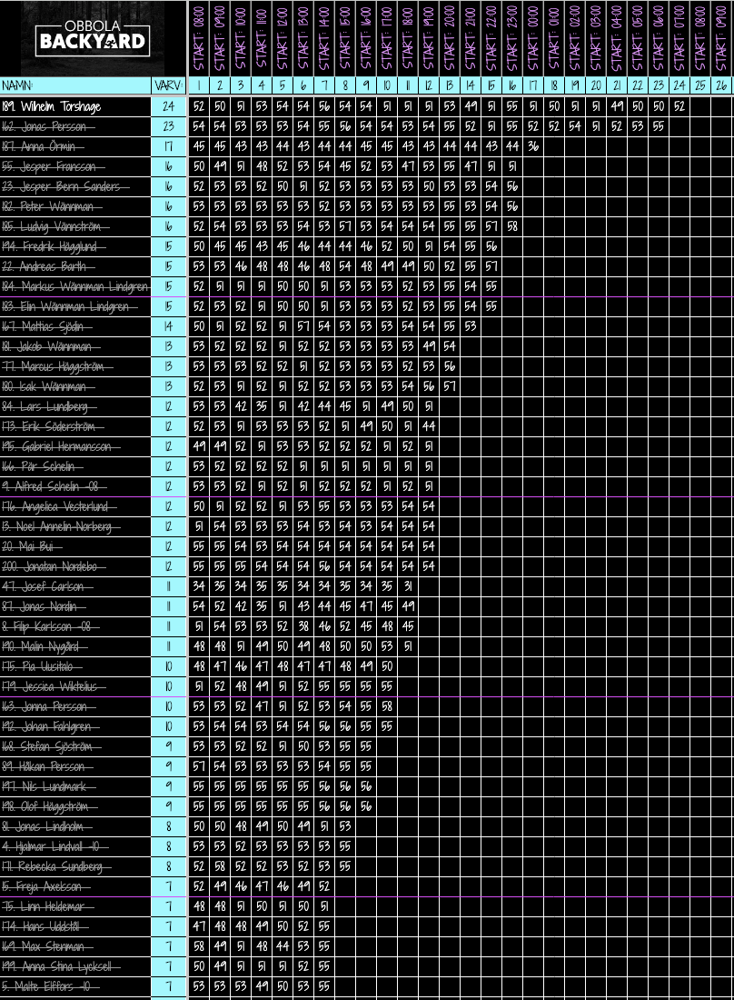

# Backyard Ultra Live Tracker

## Overgripande malbild

Appen ska pa sikt vara en plattform for flera typer av tavlingar och arrangorer.

Backyard Ultra ar den forsta tavlingstypen som byggs och anvands som exempel i UI:t. Backend, API och datamodell ska anda designas sa att fler tavlingskategorier kan laggas till utan att hela koden behover skrivas om.

Systemet ska stodja:

- flera arrangorer
- flera tavlingar per arrangor
- tavlingar i olika kategorier
- tavlingsmallar for regler som hor till en viss tavlingstyp
- deltagare kopplade till specifika tavlingar
- individuell anmalan och laganmalan
- funktionarer kopplade till specifika tavlingar
- publik visning av tavlingar utan login
- regler och vyer som kan skilja sig mellan olika tavlingstyper

## Tavlingsmallar

Regler som ar specifika for en tavlingstyp ska sparas i en tavlingsmall.

Backyard Ultra ska ha en egen mall som beskriver reglerna for just Backyard Ultra.

Tavlingar som skapas i kategorin Backyard Ultra ska kunna anvanda Backyard Ultra-mallen som standard.

Backyard Ultra-mallen ska innehalla regler som:

- varje varv ar en timme
- varje varv visas som en ny kolumn till hoger i live-dashboarden
- aktiva lopare har en malknapp i en egen kolumn bredvid namnet
- nar funktionaren klickar pa malknappen fylls tiden i ratt varvkolumn for aktuellt varv
- om varvet tar slut utan registrerad varvtid visas en DNF-knapp
- DNF-knappen anvands for att bekrafta att loparen har avslutat tavlingen
- en lopare med bekraftad DNF gar inte vidare till nasta varv
- ny varvkolumn skapas bara om minst tva lopare har gatt i mal pa foregaende varv
- tavlingen fortsatter tills endast en lopare aterstar

Mallen ska hjalpa appen att skilja mellan generell tavlingslogik och regler som bara galler Backyard Ultra.

## Tavlingsinstallningar och status

Arrangoren ska kunna valja om en tavling ar publik eller privat.

Som standard ska nya tavlingar vara publika, sa att publiken kan hitta och folja dem utan login.

Arrangoren ska ange:

- tavlingsnamn
- tavlingskategori
- plats
- startdatum och starttid
- sista anmalningsdag
- om tavlingen ar publik eller privat
- om sjalvanmalan ar tillaten
- om laganmalan ar tillaten
- om deltagare far ange klubb, forening, foretag eller organisation

Sista anmalningsdag ska visas tydligt pa tavlingens informationssida.

Tavlingen ska starta automatiskt nar starttiden passerar.

Tavlingen ska kunna ha tydliga statusar, till exempel:

- utkast
- oppen for anmalan
- stangd for anmalan
- pagar
- avslutad

Anmalan ska stangas nar sista anmalningsdag har passerat. Arrangoren ska ocksa kunna stanga anmalan manuellt.

## Syfte

Den forsta versionen ska gora det mojligt att folja lopare live under en Backyard Ultra-tavling. Varje lopare springer ett varv varje timme tills endast en lopare aterstar.

Appen ska visualisera:

- deltagarlista
- aktuell tavling
- aktuellt varvnummer
- loparnas varvtider
- medeltid per varv
- vilka lopare som fortfarande ar kvar i tavlingen

## Roller

Appen ska ha olika roller med olika behorigheter.

### Publik anvandare

Publiken ska kunna folja tavlingar utan att logga in.

Publiken ska kunna:

- se lista over publika tavlingar
- oppna en tavlings live-dashboard
- se deltagare
- se varvtider och resultat
- se aktuell status och aktuellt varv

Publiken ska inte kunna:

- skapa tavlingar
- andra tavlingar
- registrera varvtider
- lagga till eller ta bort deltagare
- hantera funktionarer

### Deltagare

Deltagare ska kunna anmala sig sjalva till tavlingar dar arrangoren har oppnat for sjalvanmalan.

Deltagare ska kunna:

- skapa en individuell anmalan
- skapa eller ga med i en laganmalan om tavlingen tillater lag
- ange lagnamn vid laganmalan
- se sina egna anmalningar nar deltagaren ar inloggad

### Funktionar

Funktionaren ska kunna hjalpa till under en tavling.

Funktionaren ska kunna:

- registrera varvtider
- uppdatera live-resultat for den tavling funktionaren ar kopplad till

Funktionaren ska inte automatiskt kunna:

- skapa nya tavlingar
- ta bort tavlingar
- hantera andra arrangorers tavlingar

### Arrangor

Arrangoren ska kunna hantera sina egna tavlingar.

Arrangoren ska kunna:

- skapa tavlingar
- redigera egna tavlingar
- lagga till och hantera deltagare
- koppla funktionarer till egna tavlingar
- hantera live-dashboarden for egna tavlingar

### Admin

Admin ar en overgripande systemroll.

Admin ska kunna:

- se och hantera alla arrangorer
- se och hantera alla tavlingar
- hjalpa till med systemadministration

## Funktioner i forsta versionen

Forsta versionen ska fokusera pa Backyard Ultra-flodet.

Appen ska kunna:

- visa alla deltagare i en vansterkolumn
- visa en funktionskolumn med malknapp eller DNF-knapp bredvid namnet i funktionarslage
- visa varvtider i en hogerkolumn eller tydlig varvtabell
- visa aktuellt varvnummer hogst upp
- registrera varvtid for en lopare med knapptryck
- fylla i registrerad tid i varvkolumnen som motsvarar aktuellt varv
- berakna och visa medeltid per varv for varje lopare
- bara visa lopare som fortfarande ar kvar i tavlingen som valbara for nasta varv
- skapa en ny varvkolumn automatiskt nar minst tva lopare har gatt i mal pa foregaende varv
- fortsatta tavlingen tills endast en lopare aterstar

Mockdata kan anvandas initialt. Backend och databas ska kopplas pa stegvis.

## Live-dashboard: UI och anvandbarhet

Live-dashboarden ska ha en modern sportapp-kansla.

Den ska vara tydlig, snabb att lasa och fungera bra under en aktiv tavling.

Dashboarden ska visa mycket data utan att kannas rorig.

Dashboarden ska vara inspirerad av en klassisk Backyard Ultra-resultattavla, men uttrycket ska vara modernare och mer app-likt.

Layouten ska innehalla:

- tavlingsnamn eller logotyp
- deltagarnamn
- loparnummer om tavlingen anvander det
- antal klarade varv
- funktionskolumn med mal- eller DNF-knapp i funktionarslage
- en tabell dar varje varv ar en egen kolumn
- starttid for varje varv overst
- varvnummer under starttiden
- varvtid i varje lopares cell
- tomma celler for framtida varv

Varvtabellen ska kunna scrollas horisontellt nar det finns manga varvkolumner.

Deltagarnamn och funktionskolumn ska vara enkla att hitta aven nar anvandaren scrollar i varvtabellen.

Publik vy ska visa resultat och status utan redigeringsknappar.

Funktionarslage ska bygga pa samma grundtabell, men lagga till funktionskolumnen och funktionarsverktyg.

Nar en lopare har brutit tavlingen ska det racka att visa texten `DNF`.

DNF ska visas tydligt pa loparens rad och i relevant resultatstatus.

Nar anvandaren hovrar over en lopares namn ska appen visa extra information om loparen.

Hoverinformationen ska kunna visa:

- klubb, forening, foretag eller organisation som loparen representerar
- vilket lag loparen tillhor, om loparen deltar i lag
- eventuellt loparnummer eller annan kort deltagarinformation

Om loparen inte har angett klubb, forening, foretag, organisation eller lag ska hoverinformationen inte visa tomma falt.

Publik, funktionar, arrangor och admin ska kunna se hoverinformationen, men bara behoriga roller ska kunna andra uppgifterna.

I funktionarslage ska funktionaren kunna filtrera deltagarlistan till bara aktiva lopare.

Det ska gora det enklare att registrera maltider under pagaende varv.

I funktionarslage ska funktionaren ocksa kunna sortera deltagarlistan for att snabbare hitta ratt lopare.

Funktionaren ska kunna sortera pa:

- loparnummer
- snittid per varv

Sortering pa loparnummer gor det latt att hitta en specifik deltagare.

Sortering pa snittid per varv gor det lattare att se vilken ordning deltagare vanligtvis kommer in over mallinjen.

Det ska hjalpa funktionaren att upptacka monster, till exempel vilka lopare som ofta springer tillsammans.

## Backyard Ultra: varv, malknapp och DNF

Backyard Ultra-reglerna ska komma fran Backyard Ultra-mallen.

I funktionarslage ska varje aktiv lopare ha en malknapp i en egen kolumn bredvid namnet.

Knappen ska inte ligga i sjalva varvtabellen.

Nar funktionaren klickar pa malknappen ska appen registrera aktuell tidpunkt som loparens maltid for aktuellt varv.

Den registrerade tiden ska fyllas i den varvkolumn som motsvarar aktuellt varv.

Exempel:

- om aktuellt varv ar 4 ska klicket fylla i loparens cell i kolumn 4
- om aktuellt varv ar 12 ska klicket fylla i loparens cell i kolumn 12

Efter klicket ska loparens knapp visa att tiden for aktuellt varv redan ar registrerad, eller vara inaktiv tills nasta varv borjar.

Om varvets tid tar slut utan att loparen har fatt en registrerad varvtid ska malknappen ersattas med en DNF-knapp.

DNF-knappen anvands for att bekrafta att loparen har avslutat tavlingen.

En lopare med bekraftad DNF ska inte vara valbar for nasta varv.

Varje varv ska visas som en egen kolumn i live-dashboarden.

Nya varvkolumner ska dyka upp till hoger i tabellen.

En ny varvkolumn ska bara skapas om minst tva lopare har gatt i mal pa foregaende varv.

Om farre an tva lopare har gatt i mal pa foregaende varv ska inga nya varvkolumner skapas och tavlingen ska kunna avslutas.

Tiden och DNF-statusen ska sparas som resultatdata, inte bara visas i frontend.

## Manuell korrigering vid missad registrering

I funktionarslage ska ett vanligt klick pa malknappen registrera aktuell tidpunkt direkt.

Om funktionaren haller in malknappen ska appen oppna ett manuellt lage dar funktionaren kan ange hur manga minuter in pa varvet loparen gick i mal.

Det manuella laget anvands nar funktionaren missade att registrera loparen direkt vid malgang.

Alla funktionarer som ar kopplade till tavlingen ska fa anvanda manuell registrering.

Samma princip ska kunna anvandas vid DNF-knappen om funktionaren behover ange eller korrigera information om nar loparen avslutade.

Vid manuell korrigering ska funktionaren ange en kort anledning, till exempel:

- missade klick vid malgang
- fel lopare klickades
- tekniskt problem
- DNF registrerades for sent

Manuell registrering ska valideras av backend.

Backend ska kontrollera att:

- tiden hor till ratt varv
- tiden ligger inom tillatet intervall for varvet
- loparen fortfarande kan fa tid eller DNF pa det varvet
- funktionaren ar kopplad till tavlingen

## Loggning av resultatandringar

Alla resultatandringar ska loggas.

Det galler:

- vanlig malgangsregistrering
- manuell registrering via langtryck
- DNF-registrering
- korrigering av redan registrerad varvtid
- korrigering av DNF-status

Loggen ska spara:

- vilken tavling andringen galler
- vilken lopare eller vilket lag andringen galler
- vilket varv andringen galler
- vilken funktionar, arrangor eller admin som gjorde andringen
- vilken typ av andring som gjordes
- nar andringen gjordes
- tidigare varde om ett varde andrades
- nytt varde efter andringen
- anledning till andringen vid manuell korrigering

Loggningen ska anvandas for sparbarhet, felsokning och trygg hantering av resultat.

Loggningen ska folja principen om dataminimering: spara det som behovs for sparbarhet, men inte mer.

## Anmalan

Appen ska stodja bade individuell anmalan och laganmalan.

Arrangoren ska kunna valja anmalningslage for varje tavling:

- deltagare kan anmala sig sjalva
- endast arrangoren kan lagga till deltagare
- bade sjalvanmalan och arrangorsanmalan ar tillatet

Arrangoren ska ocksa kunna valja vilka frivilliga deltagaruppgifter som far anges vid anmalan.

Arrangoren ska kunna valja om deltagare far ange vilken klubb, forening, foretag eller organisation de representerar.

Vid individuell anmalan anger deltagaren sina egna uppgifter.

Vid laganmalan ska deltagaren eller arrangoren kunna ange:

- lagnamn
- deltagare i laget
- kontaktperson
- eventuell klubb eller organisation

Om installningen for klubb, forening, foretag eller organisation ar aktiv ska anmalningsformular visa ett frivilligt falt for detta.

Om installningen ar avstangd ska faltet inte visas i frontend och backend ska inte krava varde for faltet.

Om sjalvanmalan ar avstangd ska publika anvandare inte kunna skapa en anmalan. Backend ska kontrollera detta, inte bara frontend.

Om laganmalan inte ar tillaten for tavlingen ska backend neka anmalningar med lagnamn eller lagdeltagare.

## Lagvisning

Vid laganmalan ska resultat och deltagarlista visa lagnamnet tydligt.

Under lagnamnet ska appen visa vilka deltagare som ingar i laget.

Exempel:

- Team Skogen
  - Anna Andersson
  - Omar Svensson
  - Lina Berg

Lagets resultat ska kunna kopplas till laget, men deltagarna ska fortfarande kunna visas som personer i laget.

## Anvandarflode: publik

1. Publiken oppnar appen utan login.
2. Publiken ser en lista over publika tavlingar.
3. Publiken valjer en tavling.
4. Publiken ser live-dashboarden med deltagare, varvtider, aktuellt varv och status.
5. Publiken kan folja tavlingen men inte andra nagra uppgifter.

## Anvandarflode: deltagare

1. Deltagaren oppnar en publik tavling.
2. Om sjalvanmalan ar oppen kan deltagaren valja att anmala sig.
3. Deltagaren valjer individuell anmalan eller laganmalan om tavlingen tillater lag.
4. Vid laganmalan anger deltagaren lagnamn och lagets deltagare.
5. Backend validerar att tavlingen tillater sjalvanmalan och vald anmalningstyp.
6. Deltagaren far bekraftelse pa att anmalan ar skapad.

## Anvandarflode: funktionar

1. Funktionaren loggar in.
2. Funktionaren valjer den tavling som hen ar kopplad till.
3. Nar en lopare gar i mal pa ett varv klickar funktionaren pa malknappen i kolumnen bredvid loparens namn.
4. Appen registrerar tiden da funktionaren klickade.
5. Tiden fylls i varvkolumnen for aktuellt varv.
6. Dashboarden uppdateras med ny varvtid och ny medeltid.
7. Om varvets tid tar slut utan registrerad varvtid visas en DNF-knapp for loparen i funktionskolumnen.
8. Funktionaren kan bekrafta DNF.
9. Om funktionaren haller in mal- eller DNF-knappen kan funktionaren fylla i en manuell korrigering.
10. Vid manuell korrigering maste funktionaren ange en kort anledning.
11. Alla resultatandringar loggas med vem som gjorde andringen och vad som andrades.
12. Nar villkoren for nasta varv ar uppfyllda skapas en ny varvkolumn.

## Anvandarflode: arrangor

1. Arrangoren loggar in.
2. Arrangoren skapar eller valjer en tavling.
3. Arrangoren anger starttid och sista anmalningsdag.
4. Arrangoren valjer om tavlingen ar publik eller privat. Publik ska vara default.
5. Arrangoren valjer om tavlingen tillater sjalvanmalan.
6. Arrangoren valjer om tavlingen tillater laganmalan.
7. Arrangoren valjer om deltagare far ange klubb, forening, foretag eller organisation.
8. Arrangoren lagger till deltagare eller lag manuellt vid behov.
9. Arrangoren kopplar funktionarer till tavlingen.
10. Arrangoren kan folja och hantera live-dashboarden.

## Resultathistorik

Nar en tavling ar avslutad ska resultatet sparas.

Publiken ska kunna se resultat fran avslutade publika tavlingar i efterhand.

Resultathistoriken ska visa:

- tavlingsnamn
- tavlingsdatum
- deltagare eller lag
- varvtider
- antal klarade varv
- DNF-status dar det ar relevant
- vinnare eller slutplacering

## Backend- och API-mal

API:t ska byggas sa att det ar smidigt att lagga till fler arrangorer, tavlingar och tavlingskategorier utan stor omskrivning.

Backend ska darfor utga fran generella resurser, till exempel:

- users
- organizers
- competitions
- competition categories
- competition templates
- runners eller participants
- registrations
- teams
- lap times eller results
- timekeepers
- result change logs

Backyard Ultra-specifik logik ska hallas sa avgransad som mojligt, sa att andra tavlingstyper kan fa egna regler senare.

## Sakerhetsprinciper

Publika `GET`-endpoints far visa tavlingar och resultat utan login.

Alla endpoints som andrar data ska skyddas med login och roller:

- `POST`
- `PUT`
- `PATCH`
- `DELETE`

Backend ska inte lita pa att frontend gommer knappar. Behorighet ska kontrolleras i backend enligt principen "don't trust the client".

Publika API-svar ska bara innehalla data som publiken far se. Andringar av resultat, deltagare, lag, tavlingar och funktionarer ska alltid ga via skyddade endpoints.

## Teknikstack

- React
- TypeScript
- Node.js
- Express
- MongoDB eller annan databas
- REST API
- Rollbaserad atkomstkontroll

## Framtida forbattrningar

- realtidsuppdatering med websockets
- statistik och visualiseringar
- admin-panel
- fler tavlingskategorier
- integration med Google Sheets eller annan datakalla
- publik/privat installning per tavling

## Installation

1. Klona projektet.
2. Installera beroenden med `npm install`.
3. Starta frontend och backend enligt projektets README.

