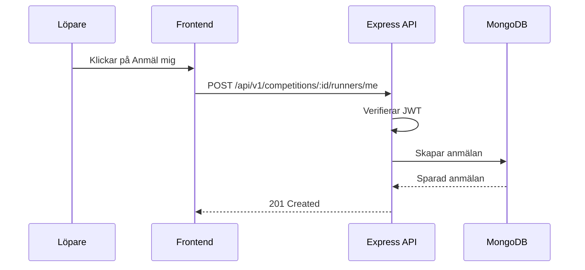

# Status och vägledning: kursvecka 1-9

Den här filen svarar på frågan: har Backyard Ultra-projektet med allt från kursvecka 1-9?

Kort svar: **nästan för vecka 1-7, delvis för vecka 8, och inte färdigt för vecka 9**.

Jag har inte ändrat någon kod i projektet när den här filen skapades. Den här filen är bara en pedagogisk vägledning för vad du har, vad som saknas och hur du kan implementera resten.

## Dokument detta bygger på

Primär källa:

- `/Users/zaidawiss/Desktop/Backendutveckling i Node.js, databaser och säkerhet (kopia).pdf`

Stödmaterial i repo:t, skapat från PDF:ens veckoplan och mål:

- `docs/pdf-inlarningsmal/vecka-01-node-express-grund.md`
- `docs/pdf-inlarningsmal/vecka-02-rest-api-struktur.md`
- `docs/pdf-inlarningsmal/vecka-03-typescript-express.md`
- `docs/pdf-inlarningsmal/vecka-04-mongodb-mongoose.md`
- `docs/pdf-inlarningsmal/vecka-05-relationer-filter-testning.md`
- `docs/pdf-inlarningsmal/vecka-06-validering-felhantering.md`
- `docs/pdf-inlarningsmal/vecka-07-sakerhet-miljo-produktion.md`
- `docs/pdf-inlarningsmal/vecka-08-rbac-konfiguration.md`
- `docs/pdf-inlarningsmal/vecka-09-gdpr-loggning-dokumentation.md`

Jag har inte använt de tidigare workshopfilerna som facit för bedömningen. De relevanta källorna här är PDF:en, vecka-01 till vecka-09-materialet och den faktiska backendkoden.

Projektfiler som kontrollerades:

- `backyard/backend/src/app.ts`
- `backyard/backend/src/server.ts`
- `backyard/backend/src/config/database.ts`
- `backyard/backend/src/routes/`
- `backyard/backend/src/controllers/`
- `backyard/backend/src/middleware/`
- `backyard/backend/src/models/`
- `backyard/backend/src/schemas/`
- `backyard/backend/src/services/`
- `backyard/backend/src/types/`
- `backyard/backend/src/__tests__/app.test.ts`
- `backyard/backend/package.json`

## Verifiering

Det här går igenom just nu:

```bash
cd backyard/backend
npm run build
npm test
```

Det betyder att TypeScript bygger och integrationstesterna går igenom. Bra jobbat här: det visar att vecka 1-7-grunden är stabil nog för att bygga vidare på.

## Samlad status

| Vecka | Område | Status | Vad saknas mest? |
| --- | --- | --- | --- |
| 1 | Node.js, HTTP, Express | Klart | Inget stort. |
| 2 | REST, routes, middleware | Klart | Inget stort. |
| 3 | TypeScript i Express | Klart | Param-validering kan göras ännu tydligare. |
| 4 | MongoDB och Mongoose | Klart | Inget stort. |
| 5 | Relationer, filter, testning | Delvis klart | Pagination, tydliga index och eventuell `populate`. |
| 6 | Validering och felhantering | Delvis klart | Params bör valideras som middleware/schema, inte bara i controller. |
| 7 | Säkerhet, bcrypt, JWT | Klart nog | `AUTH_SECRET` bör komma från samlad config utan fallback i produktion. |
| 8 | RBAC och konfiguration | Inte klart | `admin`, `requireRole`, roller i DB och `config/env.ts`. |
| 9 | GDPR, loggning, dokumentation | Inte klart | Strukturerad loggning, soft delete, API-dokumentation och Mermaid-flöden. |

## Vecka 1: Node.js, HTTP och Express

### Status

Det här finns:

- Express-app i `backyard/backend/src/app.ts`
- Serverstart i `backyard/backend/src/server.ts`
- Routes för API-resurser
- `GET`, `POST`, `PUT`, `DELETE`
- `201` vid skapande
- `404` vid saknade resurser

Viktiga rader:

- `app.ts` rad 10: `const app = express();`
- `app.ts` rad 16: `app.use(express.json());`
- `server.ts` rad 15: `app.listen(...)`

### Fråga till dig

Varför ligger `app.listen(...)` i `server.ts` och inte direkt i `app.ts`?

Svar: för att tester kan importera `app` utan att starta servern på en fast port.

## Vecka 2: REST API, struktur och middleware

### Status

Det här finns:

- `routes/`
- `controllers/`
- `middleware/`
- `schemas/`
- `/api/v1`
- central 404-handler
- central error handler

Viktiga rader:

- `app.ts` rad 21-23: routes monteras under `/api/v1`
- `app.ts` rad 26: `notFoundHandler`
- `app.ts` rad 29: `errorHandler`

### Fråga till dig

Varför ska route-filen inte innehålla all databaskod?

Svar: route-filen ska visa URL och middleware-kedja. Controller/service/model ska bära logiken.

## Vecka 3: TypeScript i Express

### Status

Det här finns:

- TypeScript i backend
- `Request`, `Response`, `NextFunction`
- egna domäntyper i `types/domain.ts`
- Express-augmentering i `types/express.d.ts`
- `unknown` i validering

Viktiga rader:

- `validate.ts` rad 12: `type BodyParser = (body: unknown) => unknown;`
- `types/express.d.ts` rad 6-10: egna fält på `Request`

### Kvar att förbättra

Parametrar som `req.params.id` valideras i controllers, men kursvecka 6 nämner också param-validering. Det kan bli tydligare med en egen params-middleware.

## Vecka 4: MongoDB och Mongoose

### Status

Det här finns:

- Mongoose dependency
- MongoDB-anslutning
- Mongoose models
- controllers använder databasen
- `null`/saknade resurser blir `404`

Viktiga filer:

- `models/competition.model.ts`
- `models/organizer.model.ts`
- `models/runner.model.ts`
- `models/runnerAccount.model.ts`
- `config/database.ts`

Viktiga rader:

- `database.ts` rad 10: `mongoose.connect(...)`
- `competition.model.ts` rad 8: `new Schema(...)`
- `competitionsController.ts` rad 28: `getCompetitionOrThrow(...)`

### Fråga till dig

Vad är skillnaden mellan `schemas/competitionSchema.ts` och `models/competition.model.ts`?

Svar:

- `schemas/competitionSchema.ts` validerar request body från klienten.
- `models/competition.model.ts` beskriver hur data sparas i MongoDB.

## Vecka 5: relationer, filtrering och testning

### Status

Det här finns:

- query-filter för tävlingar
- sortering på `startAt`
- relationer via `ObjectId`
- integrationstester
- testdatabas med `mongodb-memory-server`

Viktiga rader:

- `controllers/competitionsController.ts` rad 55-57: `find(...).sort({ startAt: 1 })`
- `services/competitionQuery.ts` rad 83: `buildCompetitionQuery(...)`
- `models/runner.model.ts` rad 10-18: relationer till `Competition` och `RunnerAccount`
- `__tests__/app.test.ts` rad 50-51: minnesdatabas

### Kvar att fixa

1. Pagination saknas.
2. Unikt index för att hindra dubbelanmälan saknas.
3. `populate` används inte, även om du manuellt hämtar relaterad tävling i vissa flöden.

### Kodexempel: pagination

Fil att skapa:

`backyard/backend/src/schemas/paginationSchema.ts`

```ts
import HttpError from "../errors/httpError";

export type Pagination = {
  page: number;
  limit: number;
};

const parsePositiveInt = (
  value: unknown,
  fallback: number,
  fieldName: string,
): number => {
  if (!value) {
    return fallback;
  }

  const parsedValue = Number(value);

  if (!Number.isInteger(parsedValue) || parsedValue < 1) {
    throw new HttpError(400, "BAD_REQUEST", `${fieldName} måste vara ett positivt heltal`);
  }

  return parsedValue;
};

export const parsePagination = (query: Record<string, unknown>): Pagination => {
  return {
    page: parsePositiveInt(query.page, 1, "page"),
    limit: parsePositiveInt(query.limit, 20, "limit"),
  };
};
```

Varför? Utan pagination kan `GET /competitions` försöka skicka tillbaka tusentals dokument. Det blir långsamt och dyrt.

### Kodexempel: unikt index för anmälan

Fil att uppdatera:

`backyard/backend/src/models/runner.model.ts`

Lägg efter `runnerSchema`:

```ts
runnerSchema.index(
  { competitionId: 1, runnerAccountId: 1 },
  {
    unique: true,
    partialFilterExpression: {
      runnerAccountId: { $type: "objectId" },
    },
  },
);
```

Varför? Controllern kontrollerar redan dubbelanmälan, men ett unikt index gör att databasen också skyddar regeln. Det är viktigt om två requests kommer nästan samtidigt.

## Vecka 6: validering och felhantering

### Status

Det här finns:

- body-validering före controllers
- query-validering för tävlingsfilter
- central `HttpError`
- central error handler
- konsekvent felformat

Viktiga rader:

- `middleware/validate.ts` rad 14: `validateBody`
- `schemas/competitionFiltersSchema.ts` rad 60: `parseCompetitionFilters`
- `middleware/errorHandler.ts` rad 14: `errorHandler`

### Kvar att fixa

Param-validering kan bli tydligare. Just nu ligger ObjectId-kontroll i controllers, till exempel:

- `competitionsController.ts` rad 20: `toObjectIdOrThrow`

Det fungerar, men kursmålet blir tydligare om `params` också valideras via middleware/schema.

### Kodexempel: params-schema

Fil att skapa:

`backyard/backend/src/schemas/paramsSchema.ts`

```ts
import { Types } from "mongoose";
import HttpError from "../errors/httpError";

export type IdParams = {
  id: string;
};

export const parseIdParam = (params: Record<string, unknown>): IdParams => {
  const id = params.id;

  if (typeof id !== "string" || !Types.ObjectId.isValid(id)) {
    throw new HttpError(400, "BAD_REQUEST", "id måste vara ett giltigt MongoDB-id");
  }

  return { id };
};
```

Varför? Då stoppas felaktiga URL-parametrar tidigt, precis som felaktig body stoppas tidigt.

## Vecka 7: säkerhet, OWASP, lösenord och JWT

### Status

Det här finns:

- bcrypt
- jsonwebtoken
- register/login
- JWT i `Authorization: Bearer <token>`
- skyddade routes
- ägarskapskontroll för tävlingar
- kontrollerade MongoDB-querys via parser/service

Viktiga rader:

- `package.json` rad 17: `bcrypt`
- `package.json` rad 20: `jsonwebtoken`
- `utils/security.ts` rad 19: `hashPassword`
- `utils/security.ts` rad 30: `createToken`
- `middleware/auth.ts` rad 19: `getTokenPayload`

### Kvar att förbättra

`AUTH_SECRET` har fallback:

```ts
process.env.AUTH_SECRET || "dev-secret-change-me"
```

Det är okej för lokal övning, men i produktion bör appen krascha om secret saknas.

## Vecka 8: RBAC och konfiguration

### Status

Det här är **delvis klart**:

- token innehåller roll
- det finns skillnad mellan arrangör och löpare
- separata middleware finns: `requireAuth` och `requireRunnerAuth`

Det här saknas:

- `admin` roll
- `requireRole(...)`
- roller sparas inte i databasen
- `req.authUser` finns inte
- samlad config-fil saknas

Viktiga nuvarande rader:

- `types/domain.ts` rad 84: `AuthRole` har bara `organizer` och `runner`
- `middleware/auth.ts` rad 30: rollkontroll är hårdkodad till en roll
- `organizer.model.ts` rad 18: ingen `role` i databasen
- `database.ts` rad 4: läser `process.env.MONGO_URI` direkt
- `server.ts` rad 9: läser `process.env.PORT` direkt

### Kodexempel: RBAC-typ

Fil att uppdatera:

`backyard/backend/src/types/domain.ts`

```ts
export type AuthRole = "admin" | "organizer" | "runner";

export type AuthUser = {
  id: string;
  email: string;
  role: AuthRole;
};
```

Varför? Då kan TypeScript stoppa stavfel som `"orgnaizer"` innan servern körs.

### Kodexempel: spara roll på organizer

Fil att uppdatera:

`backyard/backend/src/models/organizer.model.ts`

```ts
role: {
  type: String,
  enum: ["admin", "organizer"],
  default: "organizer",
  required: true,
},
```

Varför? Backend ska inte lita på att frontend säger vilken roll användaren har. Rollen ska komma från databasen eller en token som backend själv har skapat.

### Kodexempel: generell requireRole

Fil att uppdatera:

`backyard/backend/src/middleware/auth.ts`

```ts
import type { AuthRole } from "../types/domain";

export const requireRole = (...allowedRoles: AuthRole[]) => {
  return async (req: Request, _res: Response, next: NextFunction) => {
    try {
      const userRole = req.authUser?.role;

      if (!userRole || !allowedRoles.includes(userRole)) {
        throw new HttpError(403, "FORBIDDEN", "Du saknar behörighet");
      }

      return next();
    } catch (error) {
      return next(error);
    }
  };
};
```

Varför? `requireAuth` svarar på "vem är du?". `requireRole` svarar på "vad får du göra?".

### Kodexempel: samlad config

Fil att skapa:

`backyard/backend/src/config/env.ts`

```ts
const requiredEnv = (name: string): string => {
  const value = process.env[name];

  if (!value) {
    throw new Error(`${name} saknas i miljövariablerna`);
  }

  return value;
};

export const config = {
  nodeEnv: process.env.NODE_ENV ?? "development",
  port: Number(process.env.PORT ?? 3000),
  mongoUri: requiredEnv("MONGO_URI"),
  authSecret: requiredEnv("AUTH_SECRET"),
  corsOrigin: process.env.CORS_ORIGIN ?? "http://localhost:5173",
};
```

Varför? Då ser du på ett ställe vilka miljövariabler backend kräver.

## Vecka 9: GDPR, loggning och dokumentation

### Status

Det här är **inte färdigt ännu**.

Det här finns:

- projektet sparar relativt få personuppgifter
- lösenord returneras inte i publika responses
- morgan loggar metod, route och status
- viss dokumentation finns i `docs/pdf-inlarningsmal`

Det här saknas:

- strukturerad logger, till exempel Pino
- request-logger som inte loggar tokens/lösenord
- soft delete för konto eller anmälan
- tydlig dataminimeringsdokumentation
- API-dokumentation för endpoints
- Mermaid-diagram över auth- och anmälningsflöde

Viktiga nuvarande rader:

- `app.ts` rad 18: `morgan("dev")`
- `runner.model.ts` rad 8-30: ingen `deletedAt`
- `errorHandler.ts` rad 25: skickar `err.message`

### Fråga till dig

Varför ska du inte logga `req.body` i login?

Svar: eftersom `req.body` kan innehålla lösenord. Loggar lever ofta länge och kan läsas av fler än själva databasen.

### Kodexempel: strukturerad logger

Installera senare:

```bash
cd backyard/backend
npm install pino
```

Fil att skapa:

`backyard/backend/src/utils/logger.ts`

```ts
import pino from "pino";

export const logger = pino({
  level: process.env.NODE_ENV === "production" ? "info" : "debug",
  redact: [
    "req.headers.authorization",
    "authorization",
    "password",
    "passwordHash",
    "token",
  ],
});
```

Varför? Strukturerad loggning gör loggar lättare att söka i, och `redact` minskar risken att känslig data hamnar i loggar.

### Kodexempel: säker request logger

Fil att skapa:

`backyard/backend/src/middleware/requestLogger.ts`

```ts
import type { NextFunction, Request, Response } from "express";
import { logger } from "../utils/logger";

export const requestLogger = async (
  req: Request,
  _res: Response,
  next: NextFunction,
) => {
  logger.info(
    {
      method: req.method,
      path: req.path,
      userId: req.organizer?.id ?? req.runnerAccount?.id ?? null,
    },
    "HTTP request",
  );

  return next();
};
```

Viktigt: logga inte hela `req.body`, inte `Authorization`-headern och inte tokens.

### Kodexempel: soft delete för anmälningar

Fil att uppdatera:

`backyard/backend/src/models/runner.model.ts`

Lägg till i `runnerSchema`:

```ts
deletedAt: { type: Date, default: null },
```

Uppdatera delete-logiken senare:

```ts
runner.deletedAt = new Date();
await runner.save();
```

Varför? Ibland vill du sluta visa eller använda en anmälan utan att direkt förstöra all historik.

### Kodexempel: filtrera bort soft deleted

När du hämtar löpare:

```ts
const runners = await RunnerModel.find({
  competitionId: competition._id,
  deletedAt: null,
});
```

Varför? Soft delete fungerar bara om resten av koden kommer ihåg att inte visa raderade poster.

### Dokumentation som bör skapas för vecka 9

Skapa till exempel:

`docs/api-floden.md`

Med Mermaid:



Och enkel endpoint-dokumentation:

```md
## POST /api/v1/competitions/:competitionId/runners/me

Kräver:

- `Authorization: Bearer <token>`
- rollen `runner`

Svar:

- `201` löparen anmäldes
- `401` token saknas eller är ogiltig
- `409` löparen är redan anmäld
```

## Rekommenderad ordning framåt

Gör detta i ordning:

1. Färdigställ vecka 8 RBAC.
2. Lägg till `config/env.ts`.
3. Uppdatera `database.ts`, `server.ts` och `security.ts` till att använda config.
4. Lägg till test som visar att fel roll får `403`.
5. Lägg till pagination i `GET /api/v1/competitions`.
6. Lägg till unikt index mot dubbelanmälan.
7. Lägg till strukturerad logger.
8. Lägg till soft delete för anmälningar.
9. Skapa `docs/api-floden.md` med Mermaid och endpoint-dokumentation.

## Checklista för att vara klar med vecka 1-9

- [x] Vecka 1: Express-server och grundroutes finns.
- [x] Vecka 2: REST-struktur, routes, controllers och error handler finns.
- [x] Vecka 3: TypeScript, domäntyper och Express-typer finns.
- [x] Vecka 4: MongoDB och Mongoose används.
- [ ] Vecka 5: Pagination finns.
- [ ] Vecka 5: Unikt index skyddar mot dubbelanmälan.
- [ ] Vecka 6: Params valideras via schema/middleware.
- [x] Vecka 7: bcrypt och JWT används.
- [x] Vecka 7: Skyddade routes kräver Bearer-token.
- [ ] Vecka 8: `admin` finns i `AuthRole`.
- [ ] Vecka 8: roller sparas i databasen.
- [ ] Vecka 8: `requireRole(...)` finns.
- [ ] Vecka 8: samlad config-fil finns.
- [ ] Vecka 9: strukturerad logger finns.
- [ ] Vecka 9: känslig data redacteras i loggar.
- [ ] Vecka 9: soft delete finns.
- [ ] Vecka 9: API-flöden är dokumenterade med Mermaid.

## Det viktigaste att lära sig

Det viktigaste från vecka 1-9 är inte att bara "ha filer". Det viktiga är att du kan följa ansvarskedjan:

```text
Request
  -> route
  -> auth
  -> role/permission
  -> validation
  -> controller
  -> service
  -> model
  -> MongoDB
  -> response
```

Och säkerhetskedjan:

```text
Autentisering
  -> vem är du?

Auktorisering
  -> vad får du göra?

Ägarskap
  -> får du ändra just den här resursen?

GDPR/loggning
  -> sparar och loggar vi bara det vi behöver?
```

Du har redan en bra grund. Det du behöver öva mest på nu är vecka 8 och 9: roller, config, loggning, dataminimering och dokumenterade flöden. Det är precis de delarna som gör att backend känns mer som ett riktigt system och inte bara som endpoints som råkar fungera.
