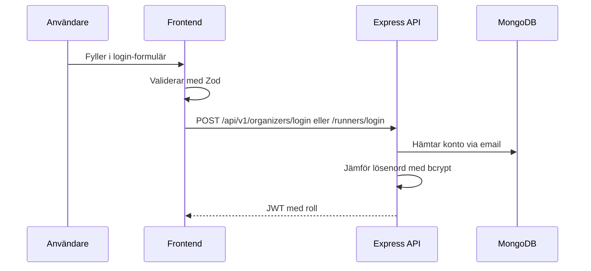
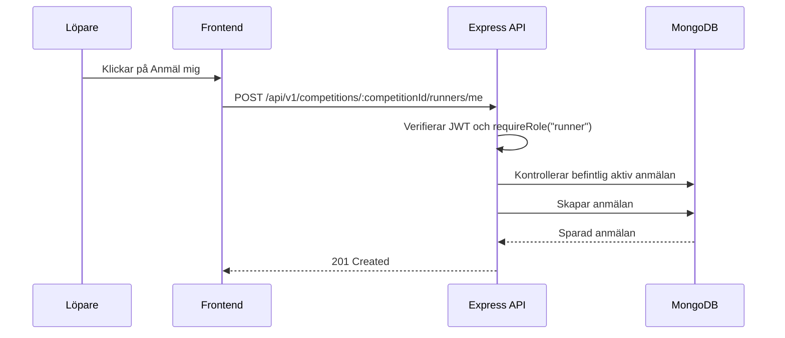
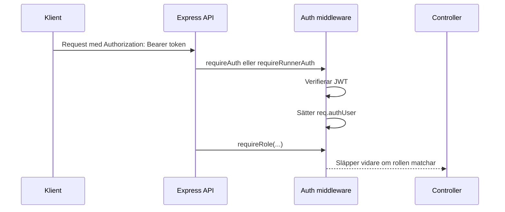
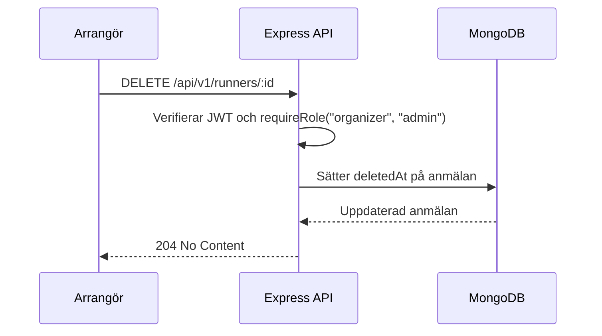

# API-flöden: Backyard Ultra

Relaterade dokument:

- [Dokumentationsöversikt](./README.md)
- [GDPR, loggning och radering](./gdpr-loggning.md)
- [Status vecka 1-9](../backyard/vecka-01-09-status-och-vagledning.md)

## Auth-flöde



## Anmälningsflöde



## Roll- Och Behörighetsflöde



## Soft Delete-Flöde



## Viktiga endpoints

```md
POST /api/v1/organizers/register
POST /api/v1/organizers/login
GET  /api/v1/organizers/me

GET    /api/v1/competitions?page=1&limit=20
POST   /api/v1/competitions
GET    /api/v1/competitions/:id
PUT    /api/v1/competitions/:id
DELETE /api/v1/competitions/:id

GET  /api/v1/competitions/:competitionId/runners
POST /api/v1/competitions/:competitionId/runners
POST /api/v1/competitions/:competitionId/runners/me

POST /api/v1/runners/register
POST /api/v1/runners/login
GET  /api/v1/runners/me
GET  /api/v1/runners/me/registrations
```

## GDPR och loggning

- Frontend och backend validerar bara de fält som behövs.
- Request-loggen använder Pino och pino-http.
- Request-loggen sparar HTTP-data som metod, url, status och responstid.
- Lösenord, tokens och request body loggas inte.
- Anmälningar tas bort med soft delete (`deletedAt`) så historik kan hanteras utan att aktiva listor visar raderad data.

## Roller

Roller beskriver behörighet:

- `admin`: kan administrera bredare flöden.
- `organizer`: kan skapa och hantera tävlingar.
- `runner`: kan se tävlingar och anmäla sig.

Lag/solo bör inte bli auth-roller. Det är bättre som anmälningsdata, till exempel `teamId` eller `registrationType`, eftersom det beskriver hur någon deltar, inte vad personen får göra i systemet.
