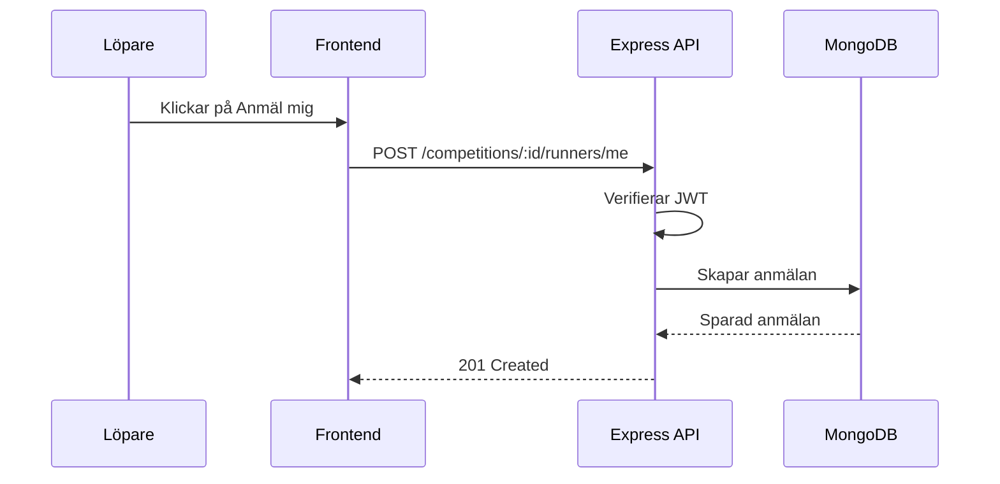

# Vecka 9: GDPR, loggning och dokumentation

## Inlärningsmål

Efter veckan ska du kunna:

- förstå GDPR-principer som dataminimering och rätt till radering
- undvika att logga känsliga personuppgifter
- använda strukturerad loggning
- planera dataflöden i backend
- förstå soft delete och datalivscykel
- känna till SQL som jämförelse till MongoDB
- dokumentera API och flöden med diagram

Bra tänkt om du frågar: "Behöver vi verkligen spara den här uppgiften?" Det är kärnan i dataminimering.

## Bygg detta

Lägg till:

- säkra loggar
- soft delete för konton eller anmälningar
- enkel API-dokumentation
- Mermaid-diagram över auth- och anmälningsflöde

## JavaScript-exempel: osäker loggning

```js
app.post('/login', (req, res) => {
  console.log('Login body:', req.body);
  res.json({ message: 'ok' });
});
```

Det här kan råka logga lösenord. Det vill du undvika.

## TypeScript-exempel: säker loggning

```ts
import type { Request, Response, NextFunction } from 'express';

export const requestLogger = async (
  req: Request,
  res: Response,
  next: NextFunction,
) => {
  console.info({
    method: req.method,
    path: req.path,
    userId: req.user?.sub ?? null,
  });

  return next();
};
```

Logga det som hjälper dig felsöka, men inte lösenord, tokens eller hela request bodies.

## Strukturerad loggning med pino

```ts
import pino from 'pino';

export const logger = pino({
  level: process.env.NODE_ENV === 'production' ? 'info' : 'debug',
  redact: ['req.headers.authorization', 'password', 'token'],
});

logger.info({ competitionId: '123' }, 'Runner registered for competition');
```

## Soft delete

```ts
const runnerSchema = new Schema(
  {
    firstName: { type: String, required: true },
    lastName: { type: String, required: true },
    email: { type: String, required: true },
    deletedAt: { type: Date, default: null },
  },
  { timestamps: true },
);
```

```ts
export const deleteRunner = async (runnerId: string) => {
  return Runner.findByIdAndUpdate(
    runnerId,
    { deletedAt: new Date() },
    { new: true },
  );
};
```

Varför? Ibland behöver du bevara historik, men ändå sluta visa eller använda personens aktiva data.

## Dataminimering i ditt projekt

Spara detta:

- namn
- email
- klubb om det behövs
- tävlingens namn, plats och datum
- anmälningsstatus

Undvik detta om det inte behövs:

- personnummer
- adress
- hälsodata
- fria textfält med känslig information

## SQL som jämförelse

```sql
SELECT runners.first_name, competitions.name
FROM registrations
JOIN runners ON registrations.runner_id = runners.id
JOIN competitions ON registrations.competition_id = competitions.id;
```

I MongoDB/Mongoose gör du ofta relationer med `ObjectId` och `populate`.

```ts
const registrations = await Registration.find()
  .populate('runner')
  .populate('competition');
```

## Mermaid: anmälningsflöde



## OpenAPI-exempel

```yaml
POST /api/v1/competitions/{id}/runners/me:
  summary: Anmäl inloggad löpare till tävling
  security:
    - bearerAuth: []
  responses:
    '201':
      description: Löparen är anmäld
    '401':
      description: Token saknas eller är ogiltig
```

## Frågor att öva på

- Vilka personuppgifter sparar projektet?
- Vilken information får aldrig hamna i loggar?
- Vad är skillnaden mellan hard delete och soft delete?
- Hur skulle du visa API-flödet för någon som aldrig sett koden?

## Finns det fler bra lösningar?

Ja. Du kan använda Winston i stället för Pino. Du kan dokumentera API:t i README, Swagger/OpenAPI eller Postman. Det viktiga är att dokumentationen går att följa.

## Checklista

- [ ] Lösenord och tokens loggas inte.
- [ ] Loggar är strukturerade.
- [ ] Personuppgifter är motiverade.
- [ ] Det finns en tanke för radering eller avregistrering.
- [ ] API-flöden är dokumenterade.
- [ ] Minst ett Mermaid-diagram finns i dokumentationen.
- [ ] README beskriver viktiga endpoints.
