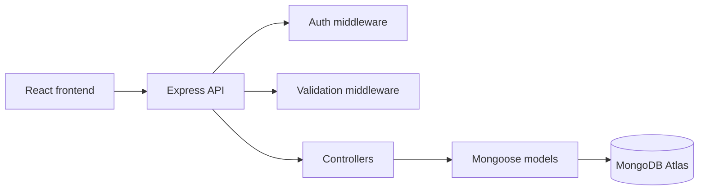

# Vecka 11: Projektdokumentation, teamflöde och repetition

## Inlärningsmål

Efter veckan ska du kunna:

- dokumentera API-endpoints
- beskriva auth-flödet
- skapa arkitekturdiagram eller flödesbeskrivningar
- skriva handover-dokumentation
- dokumentera GDPR-tänk
- arbeta med Git-flöde och code review
- repetera inför examinationen

Det du gör rätt när du skriver dokumentation är att du tvingar dig själv att förstå systemet från utsidan. Det är väldigt bra övning inför både redovisning och arbetsliv.

## Bygg detta

Skapa eller uppdatera:

- `README.md`
- endpoint-tabell
- auth-beskrivning
- miljövariabler
- datamodeller
- diagram
- testinstruktioner
- code review-checklista

## README-struktur

```md
# Backyard Ultra API

## Teknik

- Node.js
- Express
- TypeScript
- MongoDB
- Mongoose
- JWT

## Starta projektet

\`\`\`bash
npm install
npm run dev
\`\`\`

## Miljövariabler

Se `.env.example`.
```

## Endpoint-tabell

```md
| Metod | Endpoint | Skyddad | Beskrivning |
| --- | --- | --- | --- |
| POST | /api/v1/organizers/register | Nej | Skapar arrangör |
| POST | /api/v1/organizers/login | Nej | Loggar in arrangör |
| GET | /api/v1/organizers/me | Ja | Hämtar inloggad arrangör |
| POST | /api/v1/competitions | Ja | Skapar tävling |
| GET | /api/v1/competitions | Nej | Listar tävlingar |
| POST | /api/v1/competitions/:id/runners/me | Ja | Anmäler löpare |
```

## Auth-flöde

```md
1. Användaren skickar email och lösenord.
2. Backend letar upp användaren.
3. Backend jämför lösenord med bcrypt.
4. Backend skapar JWT.
5. Frontend sparar token.
6. Frontend skickar token i `Authorization` på skyddade anrop.
```

## Mermaid: arkitektur



## GDPR-dokumentation

```md
## Personuppgifter

Projektet sparar:

- namn
- email
- klubb
- tävlingsanmälningar

Projektet sparar inte:

- personnummer
- adress
- betalningsuppgifter
- hälsodata

## Radering

En användare ska kunna avregistreras eller markeras som borttagen.
```

## JavaScript-exempel: enkel testinstruktion

```js
// Körs manuellt via terminalen
// npm test
```

## TypeScript-exempel: testbar controller-idé

```ts
type RegisterRunnerInput = {
  competitionId: string;
  runnerId: string;
};

export const canRegisterRunner = (
  input: RegisterRunnerInput,
  existingRegistrationIds: string[],
) => {
  return !existingRegistrationIds.includes(input.runnerId);
};
```

Varför bryta ut logik så här? För att små funktioner är lättare att testa än hela Express-routes.

## Code review-checklista

```md
- [ ] Koden bygger utan TypeScript-fel.
- [ ] Tester passerar.
- [ ] Inga hemligheter finns i Git.
- [ ] Felhantering går via central middleware.
- [ ] Routes har validering.
- [ ] Skyddade routes har auth.
- [ ] Rollkontroll finns där det behövs.
- [ ] README stämmer med koden.
```

## Git-flöde

```bash
git status
git add .
git commit -m "Add runner registration flow"
git push
```

## Frågor att öva på

- Kan du förklara API:t utan att öppna koden?
- Vilken endpoint kräver token?
- Vilka data sparas i databasen?
- Vilka säkerhetsrisker har du hanterat?

## Finns det fler bra lösningar?

Ja. Dokumentation kan ligga i README, Swagger, Postman, Notion eller separata markdownfiler. För kursprojekt är markdown ofta bäst eftersom det ligger nära koden.

## Checklista

- [ ] README beskriver hur projektet startas.
- [ ] Alla viktiga endpoints är dokumenterade.
- [ ] Auth-flödet är beskrivet.
- [ ] Diagram finns.
- [ ] GDPR-tänk är dokumenterat.
- [ ] Testkommandon finns.
- [ ] Projektet går att lämna över till någon annan.
